# 一、环境配置与数据加载

## 1.导入必要的库


```python
import pandas as pd
import numpy as np
import matplotlib.pyplot as plt
import seaborn as sns
from datetime import datetime
from sklearn.model_selection import train_test_split
from sklearn.linear_model import LinearRegression
from sklearn.ensemble import RandomForestRegressor, GradientBoostingRegressor
from sklearn.svm import SVR
from sklearn.neighbors import KNeighborsRegressor
from sklearn.tree import DecisionTreeRegressor
from xgboost import XGBRegressor
from sklearn.model_selection import cross_val_score
from sklearn.metrics import mean_squared_error, mean_absolute_error, r2_score
from sklearn.preprocessing import StandardScaler
import warnings
warnings.filterwarnings('ignore')
```

## 2.核心配置：解决中文显示问题


```python
plt.rcParams["font.family"] = ["SimHei", "WenQuanYi Micro Hei", "Heiti TC"]  # 支持中文的字体
plt.rcParams["axes.unicode_minus"] = False  # 解决负号显示问题
sns.set(font="SimHei", font_scale=1.2)  # seaborn中文配置
```

## 3.数据集加载与初步查看


```python
# 数据集指定路径
file_path = r"C:\Users\Lenovo\Desktop\Big data assignment\NYC Property Sales\nyc-rolling-sales.csv"

# 加载数据，第一行是表头
df = pd.read_csv(file_path)

# 初步查看数据
print("===== 数据集基本信息 =====")
print(f"数据集形状（行, 列）：{df.shape}")
print("\n===== 前5行数据 =====")
display(df.head())  # 显示前5行，观察字段格式
print("\n===== 数据类型与缺失值 =====")
display(df.info())  # 查看各列数据类型及缺失值情况
print("\n===== 数值列统计描述 =====")
display(df.describe())  # 查看数值列的均值、标准差等（初步判断异常值）
```

    ===== 数据集基本信息 =====
    数据集形状（行, 列）：(84548, 22)
    
    ===== 前5行数据 =====
    


<div>
<style scoped>
    .dataframe tbody tr th:only-of-type {
        vertical-align: middle;
    }

    .dataframe tbody tr th {
        vertical-align: top;
    }

    .dataframe thead th {
        text-align: right;
    }
</style>
<table border="1" class="dataframe">
  <thead>
    <tr style="text-align: right;">
      <th></th>
      <th>Unnamed: 0</th>
      <th>BOROUGH</th>
      <th>NEIGHBORHOOD</th>
      <th>BUILDING CLASS CATEGORY</th>
      <th>TAX CLASS AT PRESENT</th>
      <th>BLOCK</th>
      <th>LOT</th>
      <th>EASE-MENT</th>
      <th>BUILDING CLASS AT PRESENT</th>
      <th>ADDRESS</th>
      <th>...</th>
      <th>RESIDENTIAL UNITS</th>
      <th>COMMERCIAL UNITS</th>
      <th>TOTAL UNITS</th>
      <th>LAND SQUARE FEET</th>
      <th>GROSS SQUARE FEET</th>
      <th>YEAR BUILT</th>
      <th>TAX CLASS AT TIME OF SALE</th>
      <th>BUILDING CLASS AT TIME OF SALE</th>
      <th>SALE PRICE</th>
      <th>SALE DATE</th>
    </tr>
  </thead>
  <tbody>
    <tr>
      <th>0</th>
      <td>4</td>
      <td>1</td>
      <td>ALPHABET CITY</td>
      <td>07 RENTALS - WALKUP APARTMENTS</td>
      <td>2A</td>
      <td>392</td>
      <td>6</td>
      <td></td>
      <td>C2</td>
      <td>153 AVENUE B</td>
      <td>...</td>
      <td>5</td>
      <td>0</td>
      <td>5</td>
      <td>1633</td>
      <td>6440</td>
      <td>1900</td>
      <td>2</td>
      <td>C2</td>
      <td>6625000</td>
      <td>2017-07-19 00:00:00</td>
    </tr>
    <tr>
      <th>1</th>
      <td>5</td>
      <td>1</td>
      <td>ALPHABET CITY</td>
      <td>07 RENTALS - WALKUP APARTMENTS</td>
      <td>2</td>
      <td>399</td>
      <td>26</td>
      <td></td>
      <td>C7</td>
      <td>234 EAST 4TH   STREET</td>
      <td>...</td>
      <td>28</td>
      <td>3</td>
      <td>31</td>
      <td>4616</td>
      <td>18690</td>
      <td>1900</td>
      <td>2</td>
      <td>C7</td>
      <td>-</td>
      <td>2016-12-14 00:00:00</td>
    </tr>
    <tr>
      <th>2</th>
      <td>6</td>
      <td>1</td>
      <td>ALPHABET CITY</td>
      <td>07 RENTALS - WALKUP APARTMENTS</td>
      <td>2</td>
      <td>399</td>
      <td>39</td>
      <td></td>
      <td>C7</td>
      <td>197 EAST 3RD   STREET</td>
      <td>...</td>
      <td>16</td>
      <td>1</td>
      <td>17</td>
      <td>2212</td>
      <td>7803</td>
      <td>1900</td>
      <td>2</td>
      <td>C7</td>
      <td>-</td>
      <td>2016-12-09 00:00:00</td>
    </tr>
    <tr>
      <th>3</th>
      <td>7</td>
      <td>1</td>
      <td>ALPHABET CITY</td>
      <td>07 RENTALS - WALKUP APARTMENTS</td>
      <td>2B</td>
      <td>402</td>
      <td>21</td>
      <td></td>
      <td>C4</td>
      <td>154 EAST 7TH STREET</td>
      <td>...</td>
      <td>10</td>
      <td>0</td>
      <td>10</td>
      <td>2272</td>
      <td>6794</td>
      <td>1913</td>
      <td>2</td>
      <td>C4</td>
      <td>3936272</td>
      <td>2016-09-23 00:00:00</td>
    </tr>
    <tr>
      <th>4</th>
      <td>8</td>
      <td>1</td>
      <td>ALPHABET CITY</td>
      <td>07 RENTALS - WALKUP APARTMENTS</td>
      <td>2A</td>
      <td>404</td>
      <td>55</td>
      <td></td>
      <td>C2</td>
      <td>301 EAST 10TH   STREET</td>
      <td>...</td>
      <td>6</td>
      <td>0</td>
      <td>6</td>
      <td>2369</td>
      <td>4615</td>
      <td>1900</td>
      <td>2</td>
      <td>C2</td>
      <td>8000000</td>
      <td>2016-11-17 00:00:00</td>
    </tr>
  </tbody>
</table>
<p>5 rows × 22 columns</p>
</div>


    
    ===== 数据类型与缺失值 =====
    <class 'pandas.core.frame.DataFrame'>
    RangeIndex: 84548 entries, 0 to 84547
    Data columns (total 22 columns):
     #   Column                          Non-Null Count  Dtype 
    ---  ------                          --------------  ----- 
     0   Unnamed: 0                      84548 non-null  int64 
     1   BOROUGH                         84548 non-null  int64 
     2   NEIGHBORHOOD                    84548 non-null  object
     3   BUILDING CLASS CATEGORY         84548 non-null  object
     4   TAX CLASS AT PRESENT            84548 non-null  object
     5   BLOCK                           84548 non-null  int64 
     6   LOT                             84548 non-null  int64 
     7   EASE-MENT                       84548 non-null  object
     8   BUILDING CLASS AT PRESENT       84548 non-null  object
     9   ADDRESS                         84548 non-null  object
     10  APARTMENT NUMBER                84548 non-null  object
     11  ZIP CODE                        84548 non-null  int64 
     12  RESIDENTIAL UNITS               84548 non-null  int64 
     13  COMMERCIAL UNITS                84548 non-null  int64 
     14  TOTAL UNITS                     84548 non-null  int64 
     15  LAND SQUARE FEET                84548 non-null  object
     16  GROSS SQUARE FEET               84548 non-null  object
     17  YEAR BUILT                      84548 non-null  int64 
     18  TAX CLASS AT TIME OF SALE       84548 non-null  int64 
     19  BUILDING CLASS AT TIME OF SALE  84548 non-null  object
     20  SALE PRICE                      84548 non-null  object
     21  SALE DATE                       84548 non-null  object
    dtypes: int64(10), object(12)
    memory usage: 14.2+ MB
    


    None


    
    ===== 数值列统计描述 =====
    


<div>
<style scoped>
    .dataframe tbody tr th:only-of-type {
        vertical-align: middle;
    }

    .dataframe tbody tr th {
        vertical-align: top;
    }

    .dataframe thead th {
        text-align: right;
    }
</style>
<table border="1" class="dataframe">
  <thead>
    <tr style="text-align: right;">
      <th></th>
      <th>Unnamed: 0</th>
      <th>BOROUGH</th>
      <th>BLOCK</th>
      <th>LOT</th>
      <th>ZIP CODE</th>
      <th>RESIDENTIAL UNITS</th>
      <th>COMMERCIAL UNITS</th>
      <th>TOTAL UNITS</th>
      <th>YEAR BUILT</th>
      <th>TAX CLASS AT TIME OF SALE</th>
    </tr>
  </thead>
  <tbody>
    <tr>
      <th>count</th>
      <td>84548.000000</td>
      <td>84548.000000</td>
      <td>84548.000000</td>
      <td>84548.000000</td>
      <td>84548.000000</td>
      <td>84548.000000</td>
      <td>84548.000000</td>
      <td>84548.000000</td>
      <td>84548.000000</td>
      <td>84548.000000</td>
    </tr>
    <tr>
      <th>mean</th>
      <td>10344.359878</td>
      <td>2.998758</td>
      <td>4237.218976</td>
      <td>376.224015</td>
      <td>10731.991614</td>
      <td>2.025264</td>
      <td>0.193559</td>
      <td>2.249184</td>
      <td>1789.322976</td>
      <td>1.657485</td>
    </tr>
    <tr>
      <th>std</th>
      <td>7151.779436</td>
      <td>1.289790</td>
      <td>3568.263407</td>
      <td>658.136814</td>
      <td>1290.879147</td>
      <td>16.721037</td>
      <td>8.713183</td>
      <td>18.972584</td>
      <td>537.344993</td>
      <td>0.819341</td>
    </tr>
    <tr>
      <th>min</th>
      <td>4.000000</td>
      <td>1.000000</td>
      <td>1.000000</td>
      <td>1.000000</td>
      <td>0.000000</td>
      <td>0.000000</td>
      <td>0.000000</td>
      <td>0.000000</td>
      <td>0.000000</td>
      <td>1.000000</td>
    </tr>
    <tr>
      <th>25%</th>
      <td>4231.000000</td>
      <td>2.000000</td>
      <td>1322.750000</td>
      <td>22.000000</td>
      <td>10305.000000</td>
      <td>0.000000</td>
      <td>0.000000</td>
      <td>1.000000</td>
      <td>1920.000000</td>
      <td>1.000000</td>
    </tr>
    <tr>
      <th>50%</th>
      <td>8942.000000</td>
      <td>3.000000</td>
      <td>3311.000000</td>
      <td>50.000000</td>
      <td>11209.000000</td>
      <td>1.000000</td>
      <td>0.000000</td>
      <td>1.000000</td>
      <td>1940.000000</td>
      <td>2.000000</td>
    </tr>
    <tr>
      <th>75%</th>
      <td>15987.250000</td>
      <td>4.000000</td>
      <td>6281.000000</td>
      <td>1001.000000</td>
      <td>11357.000000</td>
      <td>2.000000</td>
      <td>0.000000</td>
      <td>2.000000</td>
      <td>1965.000000</td>
      <td>2.000000</td>
    </tr>
    <tr>
      <th>max</th>
      <td>26739.000000</td>
      <td>5.000000</td>
      <td>16322.000000</td>
      <td>9106.000000</td>
      <td>11694.000000</td>
      <td>1844.000000</td>
      <td>2261.000000</td>
      <td>2261.000000</td>
      <td>2017.000000</td>
      <td>4.000000</td>
    </tr>
  </tbody>
</table>
</div>


# 二、数据预处理

## 1.处理SALE PRICE（核心目标变量）


```python
df["SALE PRICE"] = df["SALE PRICE"].replace(r'[\$,]', '', regex=True)  # 去除$和逗号
df["SALE PRICE"] = pd.to_numeric(df["SALE PRICE"], errors="coerce")  # 转换为数值
# 排除非实际交易（$0或NaN）和极端高价
df_clean = df[(df["SALE PRICE"] > 0) & (df["SALE PRICE"] <= 1e8)].copy()
```

## 2.处理SALE DATE（时间特征）


```python
df_clean["SALE DATE"] = pd.to_datetime(df_clean["SALE DATE"], errors="coerce") # 从字符串格式转换为pandas的datetime格式
df_clean["SALE MONTH"] = df_clean["SALE DATE"].dt.month # 提取月份
df_clean["SALE YEAR"] = df_clean["SALE DATE"].dt.year # 提取年份
print("日期转换后的缺失值数量:", df_clean["SALE DATE"].isna().sum())
```

    日期转换后的缺失值数量: 0
    

## 3.处理BOROUGH（行政区名称映射）


```python
borough_map = {1: "曼哈顿区", 2: "布朗克斯区", 3: "布鲁克林区", 4: "皇后区", 5: "斯塔滕岛"} # 创建一个字典，将数字编码映射到纽约五大行政区的对应中文名称
df_clean["BOROUGH NAME"] = df_clean["BOROUGH"].map(borough_map) # 将映射结果存储到新列"BOROUGH NAME"中
```

## 4.其他字段处理


```python
# 处理数值字段中的非数值字符（如' -  '）
numeric_cols = ["LAND SQUARE FEET", "GROSS SQUARE FEET", "YEAR BUILT", "TOTAL UNITS"]

# 清洗非数值字符，转换为float
for col in numeric_cols:
    df_clean[col] = df_clean[col].replace(r'^\s*-\s*$', np.nan, regex=True)  # 替换' -  '为NaN
    df_clean[col] = pd.to_numeric(df_clean[col], errors="coerce")  # 转为数值类型
```

## 5.缺失值检查


```python
# 检查清洗后的类型和缺失值
print("===== 数值字段处理结果 =====")
for col in numeric_cols:
    print(f"{col} 类型：{df_clean[col].dtype}，缺失值数量：{df_clean[col].isna().sum()}")

# 用中位数填充缺失值
for col in numeric_cols:
    df_clean[col] = df_clean[col].fillna(df_clean[col].median())

# 最终确认无缺失值
print("\n===== 填充后缺失值检查 =====")
for col in numeric_cols:
    print(f"{col} 缺失值数量：{df_clean[col].isna().sum()}")
```

    ===== 数值字段处理结果 =====
    LAND SQUARE FEET 类型：float64，缺失值数量：21185
    GROSS SQUARE FEET 类型：float64，缺失值数量：21734
    YEAR BUILT 类型：int64，缺失值数量：0
    TOTAL UNITS 类型：int64，缺失值数量：0
    
    ===== 填充后缺失值检查 =====
    LAND SQUARE FEET 缺失值数量：0
    GROSS SQUARE FEET 缺失值数量：0
    YEAR BUILT 缺失值数量：0
    TOTAL UNITS 缺失值数量：0
    


```python
# 保存处理后的数据集到指定地址
output_path = r"C:\Users\lenovo\Desktop\Big data assignment\NYC Property Sales\cleaned_data.csv"
df_clean.to_csv(output_path, index=False, encoding='utf-8-sig')
print(f"处理后的数据集已保存到: {output_path}")
print(f"保存的数据集形状: {df_clean.shape}")
```

    处理后的数据集已保存到: C:\Users\lenovo\Desktop\Big data assignment\NYC Property Sales\cleaned_data.csv
    保存的数据集形状: (59711, 25)
    

# 三、探索性分析

## 1.各行政区销售数量对比


```python
# 统计各行政区房产销售数量
plt.figure(figsize=(10, 6))
borough_counts = df_clean["BOROUGH NAME"].value_counts()

# 绘制柱状图
sns.barplot(x=borough_counts.index, y=borough_counts.values, 
           hue=borough_counts.index, palette="Blues_d", legend=False)
plt.title("纽约各行政区房产销售数量分布", fontsize=14, fontweight='bold') 
plt.xlabel("行政区", fontweight='bold') 
plt.ylabel("销售数量", fontweight='bold') 

# 显示具体数值
for i, v in enumerate(borough_counts.values):
    plt.text(i, v + 100, f"{v:,}", ha="center", fontweight='bold')  # 添加千位分隔符

plt.tight_layout()
plt.show()
```


    
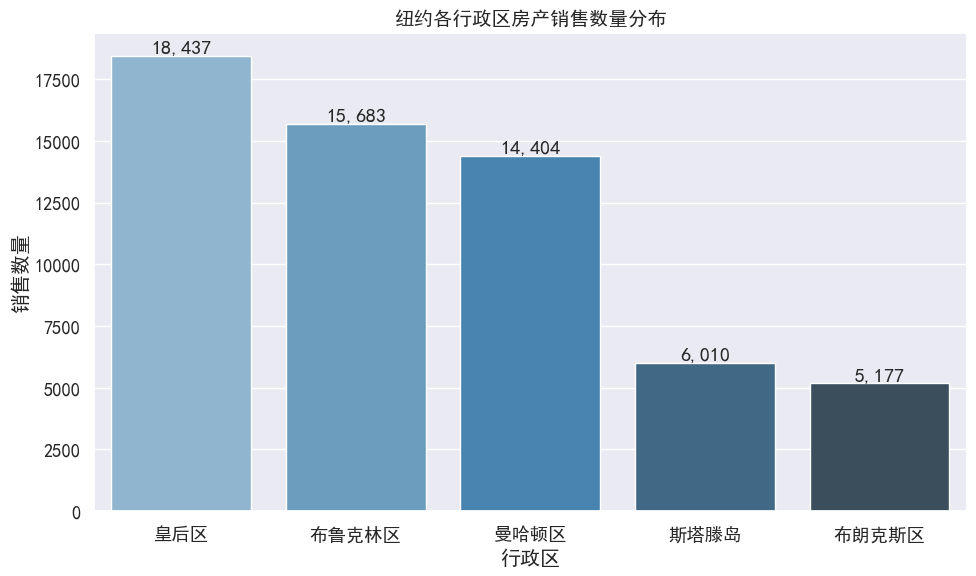
    


## 2.各行政区售价分布


```python
plt.figure(figsize=(12, 7))
filtered_price = df_clean[df_clean["SALE PRICE"] <= 5_000_000] # 筛选出售价不超过500万美元的记录，去除异常值

# 绘制箱线图
sns.boxplot(x="BOROUGH NAME", y="SALE PRICE", data=filtered_price,
           hue="BOROUGH NAME", palette="pastel", legend=False)
plt.title("纽约各行政区售价分布", fontsize=14, fontweight='bold')
plt.xlabel("行政区", fontweight='bold')
plt.ylabel("售价（美元）", fontweight='bold')
plt.yscale("log")

# 设置纵坐标范围，聚焦主要价格区间
plt.ylim(1e4, 1e7)  # 限制在1万美元到1千万美元之间
plt.grid(axis='y', alpha=0.3, linestyle='--')

plt.tight_layout()
plt.show()
```


    
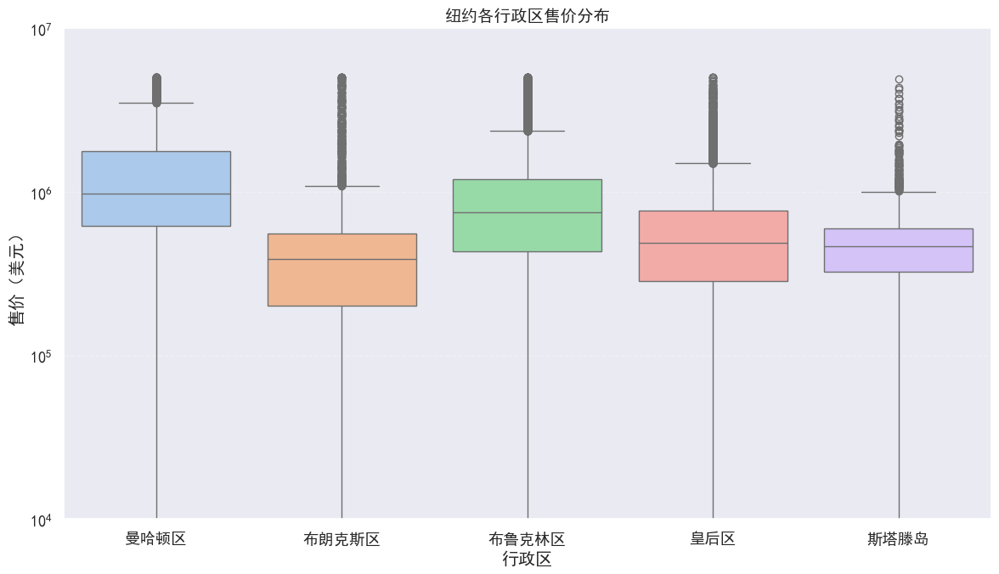
    


```python
plt.figure(figsize=(12, 7))
filtered_price = df_clean[df_clean["SALE PRICE"] <= 5_000_000] # 筛选出售价不超过500万美元的记录，去除异常值

# 绘制小提琴图
sns.violinplot(x="BOROUGH NAME", y="SALE PRICE", data=filtered_price,
              hue="BOROUGH NAME", palette="pastel", legend=False)
plt.title("纽约各行政区售价分布", fontsize=14, fontweight='bold')
plt.xlabel("行政区", fontweight='bold')
plt.ylabel("售价（美元）", fontweight='bold')
plt.yscale("log")
plt.ylim(1e4, 1e7)  # 限制范围

plt.grid(axis='y', alpha=0.3, linestyle='--')

plt.tight_layout()
plt.show()
```


    
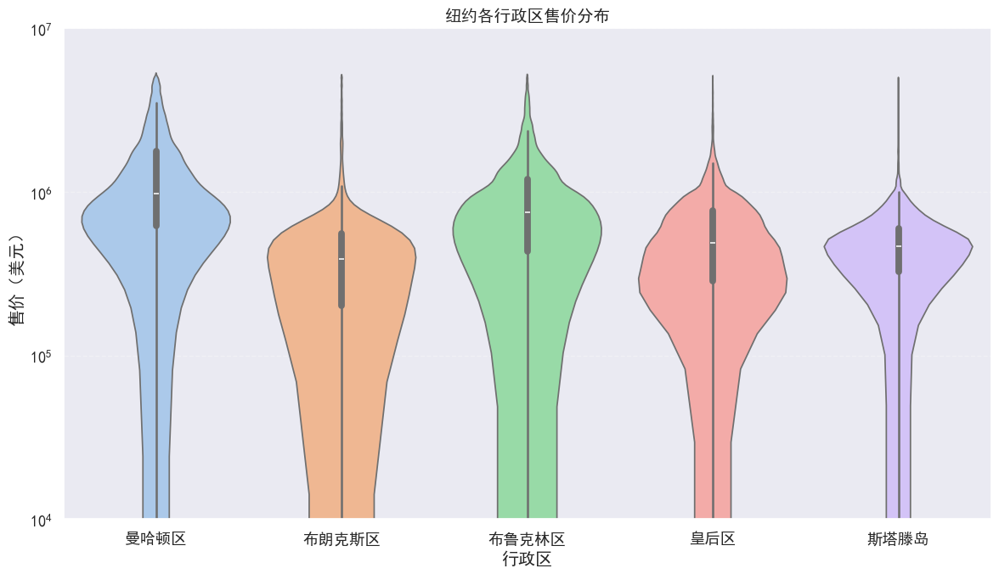
    


## 3.各行政区平均售价对比


```python
plt.figure(figsize=(10, 6))
borough_mean_price = df_clean.groupby("BOROUGH NAME")["SALE PRICE"].mean().sort_values(ascending=False)

sns.barplot(x=borough_mean_price.index, y=borough_mean_price.values, 
           hue=borough_mean_price.index, palette="Blues_d", legend=False)

plt.title("各行政区平均售价对比", fontsize=14, fontweight='bold')
plt.xlabel("行政区", fontweight='bold')
plt.ylabel("平均售价（百万美元）", fontweight='bold')

plt.grid(axis='y', alpha=0.3, linestyle='--')

# 显示平均价格（单位：百万美元）
for i, v in enumerate(borough_mean_price.values):
    plt.text(i, v + 50000, f"{v/1e6:.2f}百万", ha="center")

plt.tight_layout()
plt.show()
```


    
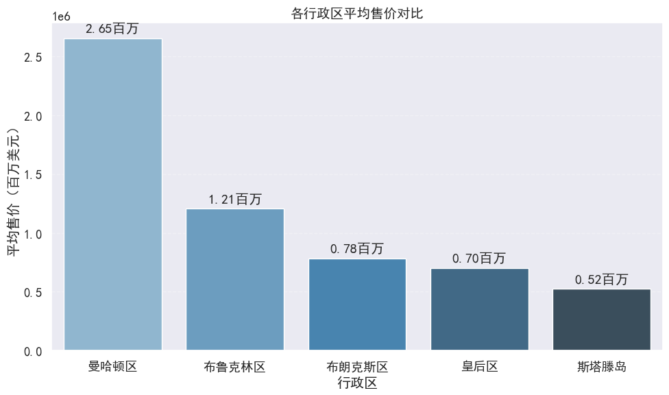
    


# 四、模型构建 - 线性回归预测售价


```python
# 读取处理后的数据集数据
df = pd.read_csv(r"C:\Users\Lenovo\Desktop\Big data assignment\NYC Property Sales\cleaned_data.csv")
# 重命名列名以便处理
df_clean = df.rename(columns={
    'BOROUGH': 'Borough',
    'BUILDING CLASS CATEGORY': 'Build class category',
    'TAX CLASS AT PRESENT': 'Tax class at present', 
    'BUILDING CLASS AT PRESENT': 'Building class at present',
    'RESIDENTIAL UNITS': 'Residential units',
    'COMMERCIAL UNITS': 'Commercial units',
    'TOTAL UNITS': 'Total units',
    'GROSS SQUARE FEET': 'Gross square feet',
    'TAX CLASS AT TIME OF SALE': 'Tax class at time of sale',
    'BUILDING CLASS AT TIME OF SALE': 'Building class at time of sale',
    'SALE PRICE': 'Sale price',
    'SALE YEAR': 'Year sale',
    'SALE MONTH': 'Month sale'
})
```

## 1.特征提取 - 选取object对象类型列


```python
nycHousePrice_1 = df_clean.select_dtypes(include='object')
print("\n分类变量列:")
print(nycHousePrice_1.columns.tolist())

# 对Borough区进行特征值提取
print("\nBorough区唯一值:")
print(df_clean['Borough'].value_counts())
boroughDf = pd.DataFrame()
boroughDf = pd.get_dummies(df_clean['Borough'], prefix='Borough')
df_clean = pd.concat([df_clean, boroughDf], axis=1)
print("Borough编码完成，新增列:", boroughDf.columns.tolist())

# 对建筑类别进行特征提取
print("\n建筑类别唯一值:")
print(nycHousePrice_1['Build class category'].value_counts())
buildCategoryDf = pd.DataFrame()
buildCategoryDf = pd.get_dummies(nycHousePrice_1['Build class category'], prefix='Build class category')
df_clean = pd.concat([df_clean, buildCategoryDf], axis=1)
print("建筑类别编码完成")

# 对当前建筑税号进行特征提取
print("\n当前税号唯一值:")
print(nycHousePrice_1['Tax class at present'].value_counts())
taxPresentDf = pd.DataFrame()
taxPresentDf = pd.get_dummies(nycHousePrice_1['Tax class at present'], prefix='Tax class at present')
df_clean = pd.concat([df_clean, taxPresentDf], axis=1)
print("当前税号编码完成")

# 对建筑当前类别进行特征提取
print("\n当前建筑类别唯一值:")
print(nycHousePrice_1['Building class at present'].value_counts())
buildClassPresentDf = pd.DataFrame()
buildClassPresentDf = pd.get_dummies(nycHousePrice_1['Building class at present'], prefix='Building class at present')
df_clean = pd.concat([df_clean, buildClassPresentDf], axis=1)
print("当前建筑类别编码完成")

# 对销售时建筑类别进行提取
print("\n销售时建筑类别唯一值:")
print(nycHousePrice_1['Building class at time of sale'].value_counts())
buildClassSaleDf = pd.DataFrame()
buildClassSaleDf = pd.get_dummies(nycHousePrice_1['Building class at time of sale'], prefix='Building class at time of sale')
df_clean = pd.concat([df_clean, buildClassSaleDf], axis=1)
print("销售时建筑类别编码完成")

# 对销售年份进行特征提取
yearSale = pd.DataFrame()
yearSale = pd.get_dummies(df_clean['Year sale'].astype(str), prefix='Year sale')
df_clean = pd.concat([df_clean, yearSale], axis=1)
print("销售年份编码完成")

# 对销售月份进行特征提取
print("\n销售月份唯一值:")
print(df_clean['Month sale'].value_counts())
monthSale = pd.DataFrame()
monthSale = pd.get_dummies(df_clean['Month sale'].astype(str), prefix='Month sale')
df_clean = pd.concat([df_clean, monthSale], axis=1)
print("销售月份编码完成")
```

    
    分类变量列:
    ['NEIGHBORHOOD', 'Build class category', 'Tax class at present', 'EASE-MENT', 'Building class at present', 'ADDRESS', 'APARTMENT NUMBER', 'Building class at time of sale', 'SALE DATE', 'BOROUGH NAME']
    
    Borough区唯一值:
    Borough
    4    18437
    3    15683
    1    14404
    5     6010
    2     5177
    Name: count, dtype: int64
    Borough编码完成，新增列: ['Borough_1', 'Borough_2', 'Borough_3', 'Borough_4', 'Borough_5']
    
    建筑类别唯一值:
    Build class category
    01 ONE FAMILY DWELLINGS                         13007
    10 COOPS - ELEVATOR APARTMENTS                  11541
    13 CONDOS - ELEVATOR APARTMENTS                 10411
    02 TWO FAMILY DWELLINGS                         10156
    09 COOPS - WALKUP APARTMENTS                     2512
    03 THREE FAMILY DWELLINGS                        2415
    07 RENTALS - WALKUP APARTMENTS                   1803
    04 TAX CLASS 1 CONDOS                            1275
    17 CONDO COOPS                                   1112
    15 CONDOS - 2-10 UNIT RESIDENTIAL                1042
    12 CONDOS - WALKUP APARTMENTS                     668
    05 TAX CLASS 1 VACANT LAND                        518
    22 STORE BUILDINGS                                490
    14 RENTALS - 4-10 UNIT                            337
    44 CONDO PARKING                                  287
    29 COMMERCIAL GARAGES                             283
    43 CONDO OFFICE BUILDINGS                         244
    21 OFFICE BUILDINGS                               209
    08 RENTALS - ELEVATOR APARTMENTS                  204
    31 COMMERCIAL VACANT LAND                         197
    30 WAREHOUSES                                     168
    27 FACTORIES                                      109
    26 OTHER HOTELS                                    94
    45 CONDO HOTELS                                    86
    46 CONDO STORE BUILDINGS                           77
    47 CONDO NON-BUSINESS STORAGE                      71
    37 RELIGIOUS FACILITIES                            64
    41 TAX CLASS 4 - OTHER                             56
    06 TAX CLASS 1 - OTHER                             50
    16 CONDOS - 2-10 UNIT WITH COMMERCIAL UNIT         38
    33 EDUCATIONAL FACILITIES                          29
    32 HOSPITAL AND HEALTH FACILITIES                  28
    23 LOFT BUILDINGS                                  22
    11A CONDO-RENTALS                                  18
    35 INDOOR PUBLIC AND CULTURAL FACILITIES           18
    38 ASYLUMS AND HOMES                               16
    28 COMMERCIAL CONDOS                               14
    48 CONDO TERRACES/GARDENS/CABANAS                  12
    49 CONDO WAREHOUSES/FACTORY/INDUS                  10
    36 OUTDOOR RECREATIONAL FACILITIES                  6
    34 THEATRES                                         5
    42 CONDO CULTURAL/MEDICAL/EDUCATIONAL/ETC           5
    40 SELECTED GOVERNMENTAL FACILITIES                 2
    11 SPECIAL CONDO BILLING LOTS                       1
    39 TRANSPORTATION FACILITIES                        1
    Name: count, dtype: int64
    建筑类别编码完成
    
    当前税号唯一值:
    Tax class at present
    2     25890
    1     25633
    4      2577
    2C     1551
    2A     1293
    1A     1119
            592
    1B      512
    2B      413
    1C      131
    Name: count, dtype: int64
    当前税号编码完成
    
    当前建筑类别唯一值:
    Building class at present
    D4    11332
    R4     9923
    A1     4849
    A5     4159
    B2     3292
          ...  
    P6        1
    O9        1
    J1        1
    Z2        1
    CM        1
    Name: count, Length: 153, dtype: int64
    当前建筑类别编码完成
    
    销售时建筑类别唯一值:
    Building class at time of sale
    D4    11334
    R4    10411
    A1     4848
    A5     4146
    B2     3285
          ...  
    O9        1
    J1        1
    Z2        1
    CM        1
    J9        1
    Name: count, Length: 153, dtype: int64
    销售时建筑类别编码完成
    销售年份编码完成
    
    销售月份唯一值:
    Month sale
    6     6035
    9     5485
    12    5398
    3     5274
    5     5268
    1     4831
    11    4790
    7     4720
    10    4603
    4     4507
    2     4416
    8     4384
    Name: count, dtype: int64
    销售月份编码完成
    

## 2.查看相关系数矩阵


```python
print("\n计算相关系数矩阵...")
corrDf = df_clean.select_dtypes(include=[np.number]).corr()

# 查看各个特征与房价的相关系数
print("\n与房价相关性最高的特征:")
price_corr = corrDf['Sale price'].sort_values(ascending=False)
print(price_corr.head(20))

# 提取重要特征构建数据集（基于相关性选择前15个特征）
top_features = price_corr[1:16].index.tolist()  # 排除Sale price本身
print(f"\n选择的特征: {top_features}")

nycPriceData = df_clean[top_features + ['Sale price']]

# 可视化相关性矩阵
plt.figure(figsize=(15, 13))
corr_X = nycPriceData.corr()
mask = np.zeros_like(corr_X, dtype=bool)
mask[np.triu_indices_from(mask)] = True

# 绘制热力图
cmap = sns.diverging_palette(220, 10, as_cmap=True)
sns.heatmap(corr_X, mask=mask, square=True, linewidths=.5, 
            annot=True, cmap=cmap, fmt='.2f')
plt.yticks(rotation=0)
plt.title('纽约房地产价格预测 - 变量相关性矩阵', size=20)
plt.tight_layout()
plt.show()

# 最终特征选择（排除与目标变量相关性低的特征）
selected_features = [feature for feature in top_features if abs(corr_X.loc[feature, 'Sale price']) > 0.1]
print(f"\n最终选择的特征 ({len(selected_features)}个): {selected_features}")
nycHousePrice_X = df_clean[selected_features]
source_y = df_clean['Sale price']
```

    
    计算相关系数矩阵...
    
    与房价相关性最高的特征:
    Sale price                   1.000000
    Tax class at time of sale    0.216284
    Gross square feet            0.203793
    Residential units            0.193964
    Total units                  0.178350
    LAND SQUARE FEET             0.082285
    LOT                          0.061003
    Commercial units             0.038147
    Month sale                   0.003910
    Year sale                   -0.001548
    YEAR BUILT                  -0.020674
    Unnamed: 0                  -0.032420
    ZIP CODE                    -0.081688
    BLOCK                       -0.163009
    Borough                     -0.202294
    Name: Sale price, dtype: float64
    
    选择的特征: ['Tax class at time of sale', 'Gross square feet', 'Residential units', 'Total units', 'LAND SQUARE FEET', 'LOT', 'Commercial units', 'Month sale', 'Year sale', 'YEAR BUILT', 'Unnamed: 0', 'ZIP CODE', 'BLOCK', 'Borough']
    


    
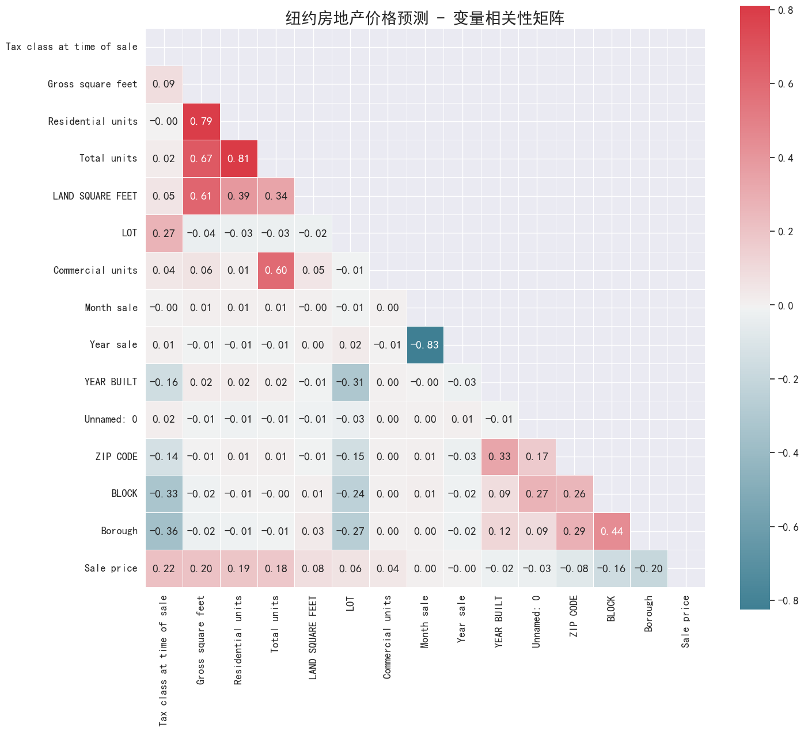
    


    
    最终选择的特征 (6个): ['Tax class at time of sale', 'Gross square feet', 'Residential units', 'Total units', 'BLOCK', 'Borough']
    

## 3.模型构建与评估

### 数据划分


```python
# 训练集和测试集的生成
train_X, test_X, train_y, test_y = train_test_split(
    nycHousePrice_X, source_y, train_size=0.8, random_state=42
)

print(f"\n数据集划分:")
print(f'原始数据集特征: {nycHousePrice_X.shape}')
print(f'训练数据集特征: {train_X.shape}')
print(f'测试数据集特征: {test_X.shape}')
print(f'原始数据集标签: {source_y.shape}')
print(f'训练数据集标签: {train_y.shape}')
print(f'测试数据集标签: {test_y.shape}')
```

    
    数据集划分:
    原始数据集特征: (59711, 6)
    训练数据集特征: (47768, 6)
    测试数据集特征: (11943, 6)
    原始数据集标签: (59711,)
    训练数据集标签: (47768,)
    测试数据集标签: (11943,)
    

### 多模型构建和比较


```python
print("\n" + "=" * 80)
print("多模型构建和性能比较")
print("=" * 80)

# 数据标准化
scaler = StandardScaler()
train_X_scaled = scaler.fit_transform(train_X)
test_X_scaled = scaler.transform(test_X)

# 定义要比较的模型
models = {
    '线性回归': LinearRegression(),
    '随机森林': RandomForestRegressor(n_estimators=100, random_state=42, n_jobs=-1),
    '梯度提升': GradientBoostingRegressor(n_estimators=100, random_state=42),
    'XGBoost': XGBRegressor(n_estimators=100, random_state=42, n_jobs=-1),
    '支持向量机': SVR(kernel='rbf', C=1.0),
    'K近邻': KNeighborsRegressor(n_neighbors=5),
    '决策树': DecisionTreeRegressor(random_state=42)
}

# 存储模型性能结果
results = {}

print("\n开始训练各种预测模型...")
print("-" * 60)

for name, model in models.items():
    print(f"正在训练 {name}...")
    
    # 选择是否使用标准化数据
    if name in ['支持向量机', 'K近邻']:
        X_train = train_X_scaled
        X_test = test_X_scaled
    else:
        X_train = train_X
        X_test = test_X
    
    # 训练模型
    model.fit(X_train, train_y)
    
    # 预测
    y_pred_train = model.predict(X_train)
    y_pred_test = model.predict(X_test)
    
    # 计算评估指标
    train_r2 = r2_score(train_y, y_pred_train)
    test_r2 = r2_score(test_y, y_pred_test)
    test_rmse = np.sqrt(mean_squared_error(test_y, y_pred_test))
    test_mae = mean_absolute_error(test_y, y_pred_test)
    
    # 存储结果
    results[name] = {
        'model': model,
        'train_r2': train_r2,
        'test_r2': test_r2,
        'test_rmse': test_rmse,
        'test_mae': test_mae,
        'predictions': y_pred_test
    }
    
    print(f"  {name} - 训练集R²: {train_r2:.4f}, 测试集R²: {test_r2:.4f}, RMSE: {test_rmse:.2f}")
```

    
    ================================================================================
    多模型构建和性能比较
    ================================================================================
    
    开始训练各种预测模型...
    ------------------------------------------------------------
    正在训练 线性回归...
      线性回归 - 训练集R²: 0.1255, 测试集R²: -0.8643, RMSE: 4933467.28
    正在训练 随机森林...
      随机森林 - 训练集R²: 0.8299, 测试集R²: 0.3578, RMSE: 2895519.77
    正在训练 梯度提升...
      梯度提升 - 训练集R²: 0.5350, 测试集R²: 0.2309, RMSE: 3168705.24
    正在训练 XGBoost...
      XGBoost - 训练集R²: 0.7702, 测试集R²: 0.2770, RMSE: 3072327.00
    正在训练 支持向量机...
      支持向量机 - 训练集R²: -0.0355, 测试集R²: -0.0344, RMSE: 3674731.93
    正在训练 K近邻...
      K近邻 - 训练集R²: 0.5672, 测试集R²: 0.2308, RMSE: 3168813.27
    正在训练 决策树...
      决策树 - 训练集R²: 0.8928, 测试集R²: 0.0740, RMSE: 3476910.50
    

### 模型性能比较和可视化


```python
# 性能比较表格
print("\n" + "=" * 80)
print("模型性能比较（按测试集R²排序）")
print("=" * 80)

performance_df = pd.DataFrame({
    '模型': list(results.keys()),
    '训练集R²': [results[name]['train_r2'] for name in results],
    '测试集R²': [results[name]['test_r2'] for name in results],
    '测试集RMSE': [results[name]['test_rmse'] for name in results],
    '测试集MAE': [results[name]['test_mae'] for name in results],
    '过拟合程度': [results[name]['train_r2'] - results[name]['test_r2'] for name in results]
}).sort_values('测试集R²', ascending=False)

print(performance_df.round(4))

# 模型性能对比柱状图
plt.figure(figsize=(16, 12))

# 1. R²分数对比柱状图
plt.subplot(2, 2, 1)
models_sorted = performance_df['模型'].values
train_r2_sorted = performance_df['训练集R²'].values
test_r2_sorted = performance_df['测试集R²'].values

x = np.arange(len(models_sorted))
width = 0.35

bars1 = plt.bar(x - width/2, train_r2_sorted, width, label='训练集R²', 
                alpha=0.8, color='#3498db', edgecolor='black')
bars2 = plt.bar(x + width/2, test_r2_sorted, width, label='测试集R²', 
                alpha=0.8, color='#e74c3c', edgecolor='black')

plt.xlabel('机器学习模型', fontsize=12, fontweight='bold')
plt.ylabel('R² 分数', fontsize=12, fontweight='bold')
plt.title('各模型R²分数性能对比', fontsize=14, fontweight='bold')
plt.xticks(x, models_sorted, rotation=45, ha='right')
plt.legend(fontsize=11)
plt.grid(True, alpha=0.3, axis='y')

# 在柱状图上添加数值标签
for bar, value in zip(bars1, train_r2_sorted):
    plt.text(bar.get_x() + bar.get_width()/2, bar.get_height() + 0.01, 
             f'{value:.3f}', ha='center', va='bottom', fontsize=9, fontweight='bold')

for bar, value in zip(bars2, test_r2_sorted):
    plt.text(bar.get_x() + bar.get_width()/2, bar.get_height() + 0.01, 
             f'{value:.3f}', ha='center', va='bottom', fontsize=9, fontweight='bold')

# 2. 误差指标对比柱状图
plt.subplot(2, 2, 2)
rmse_values = performance_df['测试集RMSE'].values
mae_values = performance_df['测试集MAE'].values

bars3 = plt.bar(x - width/2, rmse_values, width, label='RMSE', 
                alpha=0.8, color='#2ecc71', edgecolor='black')
bars4 = plt.bar(x + width/2, mae_values, width, label='MAE', 
                alpha=0.8, color='#f39c12', edgecolor='black')

plt.xlabel('机器学习模型', fontsize=12, fontweight='bold')
plt.ylabel('误差值', fontsize=12, fontweight='bold')
plt.title('各模型误差指标对比', fontsize=14, fontweight='bold')
plt.xticks(x, models_sorted, rotation=45, ha='right')
plt.legend(fontsize=11)
plt.grid(True, alpha=0.3, axis='y')

# 3. 过拟合程度分析柱状图
plt.subplot(2, 2, 3)
overfitting = performance_df['过拟合程度'].values
colors = ['#e74c3c' if x > 0.1 else '#f39c12' if x > 0.05 else '#27ae60' for x in overfitting]

bars5 = plt.bar(x, overfitting, color=colors, alpha=0.8, edgecolor='black')
plt.axhline(y=0, color='black', linestyle='-', alpha=0.3)
plt.axhline(y=0.05, color='orange', linestyle='--', alpha=0.7, label='轻微过拟合阈值')
plt.axhline(y=0.1, color='red', linestyle='--', alpha=0.7, label='严重过拟合阈值')

plt.xlabel('机器学习模型', fontsize=12, fontweight='bold')
plt.ylabel('过拟合程度\n(训练R² - 测试R²)', fontsize=12, fontweight='bold')
plt.title('模型过拟合程度分析', fontsize=14, fontweight='bold')
plt.xticks(x, models_sorted, rotation=45, ha='right')
plt.legend(fontsize=11)
plt.grid(True, alpha=0.3, axis='y')

# 在柱状图上添加数值标签
for bar, value in zip(bars5, overfitting):
    plt.text(bar.get_x() + bar.get_width()/2, bar.get_height() + 0.001, 
             f'{value:.3f}', ha='center', va='bottom', fontsize=9, fontweight='bold')

# 4. 最佳模型预测效果散点图
plt.subplot(2, 2, 4)
best_model_name = performance_df.iloc[0]['模型']
best_model = results[best_model_name]['model']
best_predictions = results[best_model_name]['predictions']

plt.scatter(test_y, best_predictions, alpha=0.6, color='purple', s=50)
plt.plot([test_y.min(), test_y.max()], [test_y.min(), test_y.max()], 'r--', lw=2, label='完美预测线')
plt.xlabel('实际价格', fontsize=12, fontweight='bold')
plt.ylabel('预测价格', fontsize=12, fontweight='bold')
plt.title(f'最佳模型 ({best_model_name}) 预测效果\n测试集R² = {results[best_model_name]["test_r2"]:.4f}', 
          fontsize=14, fontweight='bold')
plt.legend(fontsize=11)
plt.grid(True, alpha=0.3)

plt.tight_layout()
plt.show()
```

    
    ================================================================================
    模型性能比较（按测试集R²排序）
    ================================================================================
            模型   训练集R²   测试集R²       测试集RMSE        测试集MAE   过拟合程度
    1     随机森林  0.8299  0.3578  2.895520e+06  6.471217e+05  0.4721
    3  XGBoost  0.7702  0.2770  3.072327e+06  7.313217e+05  0.4933
    2     梯度提升  0.5350  0.2309  3.168705e+06  8.423079e+05  0.3041
    5      K近邻  0.5672  0.2308  3.168813e+06  7.037157e+05  0.3363
    6      决策树  0.8928  0.0740  3.476911e+06  7.425752e+05  0.8188
    4    支持向量机 -0.0355 -0.0344  3.674732e+06  9.473860e+05 -0.0012
    0     线性回归  0.1255 -0.8643  4.933467e+06  1.204270e+06  0.9899
    


    
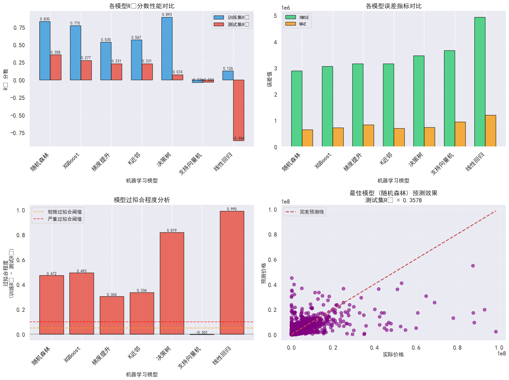
    


### 详细结果分析和最终模型推荐


```python
# 输出最佳模型详细信息
print("\n" + "=" * 60)
print("最佳模型分析")
print("=" * 60)
print(f"最佳模型: {best_model_name}")
print(f"测试集R²: {results[best_model_name]['test_r2']:.4f}")
print(f"测试集RMSE: {results[best_model_name]['test_rmse']:.2f}")
print(f"测试集MAE: {results[best_model_name]['test_mae']:.2f}")

# 特征重要性分析（对于树模型）
if hasattr(best_model, 'feature_importances_'):
    print("\n最佳模型特征重要性分析:")
    feature_importance = pd.DataFrame({
        '特征': selected_features,
        '重要性': best_model.feature_importances_
    }).sort_values('重要性', ascending=False)
    
    print(feature_importance.head(10))
    
    # 可视化特征重要性
    plt.figure(figsize=(12, 8))
    top_features_importance = feature_importance.head(15).sort_values('重要性', ascending=True)
    
    plt.barh(range(len(top_features_importance)), 
             top_features_importance['重要性'], 
             color='teal', alpha=0.7, edgecolor='black')
    
    plt.yticks(range(len(top_features_importance)), 
               top_features_importance['特征'], fontsize=10)
    plt.xlabel('特征重要性', fontsize=12, fontweight='bold')
    plt.title(f'{best_model_name} - 前15个重要特征', fontsize=14, fontweight='bold')
    plt.grid(axis='x', linestyle='--', alpha=0.7)
    
    # 在条形图右侧添加重要性值
    for i, v in enumerate(top_features_importance['重要性']):
        plt.text(v + 0.01, i, f'{v:.3f}', va='center', fontsize=9)
    
    plt.tight_layout()
    plt.show()

# 交叉验证评估最佳模型
print(f"\n对最佳模型 {best_model_name} 进行交叉验证...")
if best_model_name in ['支持向量机', 'K近邻']:
    cv_scores = cross_val_score(best_model, train_X_scaled, train_y, 
                               cv=5, scoring='r2', n_jobs=-1)
else:
    cv_scores = cross_val_score(best_model, train_X, train_y, 
                               cv=5, scoring='r2', n_jobs=-1)

print(f"交叉验证R²分数: {cv_scores.mean():.4f} (±{cv_scores.std() * 2:.4f})")

# 最终模型推荐
print("\n" + "=" * 60)
print("最终模型推荐总结")
print("=" * 60)

best_performance = performance_df.iloc[0]
original_linear_r2 = results['线性回归']['test_r2']
improvement = best_performance['测试集R²'] - original_linear_r2

print(f"推荐使用模型: {best_performance['模型']}")
print(f"测试集性能: R² = {best_performance['测试集R²']:.4f}")
print(f"相比线性回归改进: {improvement:.4f} ({improvement/original_linear_r2*100:.1f}%)")

overfit_level = best_performance['过拟合程度']
if overfit_level < 0.05:
    overfit_status = "轻微过拟合"
elif overfit_level < 0.1:
    overfit_status = "中等过拟合"
else:
    overfit_status = "严重过拟合"

print(f"过拟合程度: {overfit_level:.4f} ({overfit_status})")

print("\n其他优秀候选模型:")
for i in range(1, min(4, len(performance_df))):
    model = performance_df.iloc[i]
    print(f"  {i+1}. {model['模型']} (R² = {model['测试集R²']:.4f}, RMSE = {model['测试集RMSE']:.2f})")

print(f"\n项目总结:")
print(f"数据预处理完成: {df_clean.shape[1]}个特征")
print(f"特征工程完成: {len(selected_features)}个重要特征")
print(f"模型训练完成: {len(models)}个模型比较")
print(f"最佳模型选择: {best_model_name}")
print(f"预测性能: R² = {best_performance['测试集R²']:.4f}")

print("\n建模完成")
```

    
    ============================================================
    最佳模型分析
    ============================================================
    最佳模型: 随机森林
    测试集R²: 0.3578
    测试集RMSE: 2895519.77
    测试集MAE: 647121.71
    
    最佳模型特征重要性分析:
                              特征       重要性
    1          Gross square feet  0.400932
    4                      BLOCK  0.381493
    3                Total units  0.077454
    5                    Borough  0.077445
    2          Residential units  0.039193
    0  Tax class at time of sale  0.023484
    


    
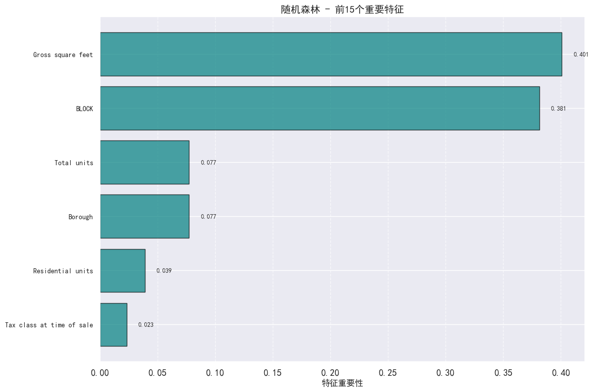
    


    
    对最佳模型 随机森林 进行交叉验证...
    交叉验证R²分数: 0.4094 (±0.0915)
    
    ============================================================
    最终模型推荐总结
    ============================================================
    推荐使用模型: 随机森林
    测试集性能: R² = 0.3578
    相比线性回归改进: 1.2221 (-141.4%)
    过拟合程度: 0.4721 (严重过拟合)
    
    其他优秀候选模型:
      2. XGBoost (R² = 0.2770, RMSE = 3072327.00)
      3. 梯度提升 (R² = 0.2309, RMSE = 3168705.24)
      4. K近邻 (R² = 0.2308, RMSE = 3168813.27)
    
    项目总结:
    数据预处理完成: 405个特征
    特征工程完成: 6个重要特征
    模型训练完成: 7个模型比较
    最佳模型选择: 随机森林
    预测性能: R² = 0.3578
    
    建模完成
    

# 下面针对纽约市各个区经济与人口情况进行对比分析

# 一、数据预处理


```python
# 读取数据集
blocks = pd.read_csv(r"C:\Users\Lenovo\Desktop\Big data assignment\New York City Census Data\census_block_loc.csv")
census = pd.read_csv(r"C:\Users\Lenovo\Desktop\Big data assignment\New York City Census Data\nyc_census_tracts.csv",index_col=0)
```


```python
blocks.head() # 坐标映射
```


<div>
<style scoped>
    .dataframe tbody tr th:only-of-type {
        vertical-align: middle;
    }

    .dataframe tbody tr th {
        vertical-align: top;
    }

    .dataframe thead th {
        text-align: right;
    }
</style>
<table border="1" class="dataframe">
  <thead>
    <tr style="text-align: right;">
      <th></th>
      <th>Latitude</th>
      <th>Longitude</th>
      <th>BlockCode</th>
      <th>County</th>
      <th>State</th>
    </tr>
  </thead>
  <tbody>
    <tr>
      <th>0</th>
      <td>40.48</td>
      <td>-74.280000</td>
      <td>340230076002012</td>
      <td>Middlesex</td>
      <td>NJ</td>
    </tr>
    <tr>
      <th>1</th>
      <td>40.48</td>
      <td>-74.276834</td>
      <td>340230076005000</td>
      <td>Middlesex</td>
      <td>NJ</td>
    </tr>
    <tr>
      <th>2</th>
      <td>40.48</td>
      <td>-74.273668</td>
      <td>340230076003018</td>
      <td>Middlesex</td>
      <td>NJ</td>
    </tr>
    <tr>
      <th>3</th>
      <td>40.48</td>
      <td>-74.270503</td>
      <td>340230076003004</td>
      <td>Middlesex</td>
      <td>NJ</td>
    </tr>
    <tr>
      <th>4</th>
      <td>40.48</td>
      <td>-74.267337</td>
      <td>340230074021000</td>
      <td>Middlesex</td>
      <td>NJ</td>
    </tr>
  </tbody>
</table>
</div>


```python
census.head() # 普查数据
```


<div>
<style scoped>
    .dataframe tbody tr th:only-of-type {
        vertical-align: middle;
    }

    .dataframe tbody tr th {
        vertical-align: top;
    }

    .dataframe thead th {
        text-align: right;
    }
</style>
<table border="1" class="dataframe">
  <thead>
    <tr style="text-align: right;">
      <th></th>
      <th>County</th>
      <th>Borough</th>
      <th>TotalPop</th>
      <th>Men</th>
      <th>Women</th>
      <th>Hispanic</th>
      <th>White</th>
      <th>Black</th>
      <th>Native</th>
      <th>Asian</th>
      <th>...</th>
      <th>Walk</th>
      <th>OtherTransp</th>
      <th>WorkAtHome</th>
      <th>MeanCommute</th>
      <th>Employed</th>
      <th>PrivateWork</th>
      <th>PublicWork</th>
      <th>SelfEmployed</th>
      <th>FamilyWork</th>
      <th>Unemployment</th>
    </tr>
    <tr>
      <th>CensusTract</th>
      <th></th>
      <th></th>
      <th></th>
      <th></th>
      <th></th>
      <th></th>
      <th></th>
      <th></th>
      <th></th>
      <th></th>
      <th></th>
      <th></th>
      <th></th>
      <th></th>
      <th></th>
      <th></th>
      <th></th>
      <th></th>
      <th></th>
      <th></th>
      <th></th>
    </tr>
  </thead>
  <tbody>
    <tr>
      <th>36005000100</th>
      <td>Bronx</td>
      <td>Bronx</td>
      <td>7703</td>
      <td>7133</td>
      <td>570</td>
      <td>29.9</td>
      <td>6.1</td>
      <td>60.9</td>
      <td>0.2</td>
      <td>1.6</td>
      <td>...</td>
      <td>NaN</td>
      <td>NaN</td>
      <td>NaN</td>
      <td>NaN</td>
      <td>0</td>
      <td>NaN</td>
      <td>NaN</td>
      <td>NaN</td>
      <td>NaN</td>
      <td>NaN</td>
    </tr>
    <tr>
      <th>36005000200</th>
      <td>Bronx</td>
      <td>Bronx</td>
      <td>5403</td>
      <td>2659</td>
      <td>2744</td>
      <td>75.8</td>
      <td>2.3</td>
      <td>16.0</td>
      <td>0.0</td>
      <td>4.2</td>
      <td>...</td>
      <td>2.9</td>
      <td>0.0</td>
      <td>0.0</td>
      <td>43.0</td>
      <td>2308</td>
      <td>80.8</td>
      <td>16.2</td>
      <td>2.9</td>
      <td>0.0</td>
      <td>7.7</td>
    </tr>
    <tr>
      <th>36005000400</th>
      <td>Bronx</td>
      <td>Bronx</td>
      <td>5915</td>
      <td>2896</td>
      <td>3019</td>
      <td>62.7</td>
      <td>3.6</td>
      <td>30.7</td>
      <td>0.0</td>
      <td>0.3</td>
      <td>...</td>
      <td>1.4</td>
      <td>0.5</td>
      <td>2.1</td>
      <td>45.0</td>
      <td>2675</td>
      <td>71.7</td>
      <td>25.3</td>
      <td>2.5</td>
      <td>0.6</td>
      <td>9.5</td>
    </tr>
    <tr>
      <th>36005001600</th>
      <td>Bronx</td>
      <td>Bronx</td>
      <td>5879</td>
      <td>2558</td>
      <td>3321</td>
      <td>65.1</td>
      <td>1.6</td>
      <td>32.4</td>
      <td>0.0</td>
      <td>0.0</td>
      <td>...</td>
      <td>8.6</td>
      <td>1.6</td>
      <td>1.7</td>
      <td>38.8</td>
      <td>2120</td>
      <td>75.0</td>
      <td>21.3</td>
      <td>3.8</td>
      <td>0.0</td>
      <td>8.7</td>
    </tr>
    <tr>
      <th>36005001900</th>
      <td>Bronx</td>
      <td>Bronx</td>
      <td>2591</td>
      <td>1206</td>
      <td>1385</td>
      <td>55.4</td>
      <td>9.0</td>
      <td>29.0</td>
      <td>0.0</td>
      <td>2.1</td>
      <td>...</td>
      <td>3.0</td>
      <td>2.4</td>
      <td>6.2</td>
      <td>45.4</td>
      <td>1083</td>
      <td>76.8</td>
      <td>15.5</td>
      <td>7.7</td>
      <td>0.0</td>
      <td>19.2</td>
    </tr>
  </tbody>
</table>
<p>5 rows × 35 columns</p>
</div>


## 1.将人口普查数据与位置数据合并


```python
blocks = blocks[blocks.County.isin(['Bronx','Kings','New York','Queens','Richmond'])] # 过滤只保留纽约市五个区的数据
blocks['Tract'] = blocks.BlockCode // 10000
blocks = blocks.merge(census,how='left',right_index=True,left_on='Tract') # 使用左连接合并位置数据和普查数据

blocks.head()
```


<div>
<style scoped>
    .dataframe tbody tr th:only-of-type {
        vertical-align: middle;
    }

    .dataframe tbody tr th {
        vertical-align: top;
    }

    .dataframe thead th {
        text-align: right;
    }
</style>
<table border="1" class="dataframe">
  <thead>
    <tr style="text-align: right;">
      <th></th>
      <th>Latitude</th>
      <th>Longitude</th>
      <th>BlockCode</th>
      <th>County_x</th>
      <th>State</th>
      <th>Tract</th>
      <th>County_y</th>
      <th>Borough</th>
      <th>TotalPop</th>
      <th>Men</th>
      <th>...</th>
      <th>Walk</th>
      <th>OtherTransp</th>
      <th>WorkAtHome</th>
      <th>MeanCommute</th>
      <th>Employed</th>
      <th>PrivateWork</th>
      <th>PublicWork</th>
      <th>SelfEmployed</th>
      <th>FamilyWork</th>
      <th>Unemployment</th>
    </tr>
  </thead>
  <tbody>
    <tr>
      <th>15</th>
      <td>40.48</td>
      <td>-74.232513</td>
      <td>360859901000011</td>
      <td>Richmond</td>
      <td>NY</td>
      <td>36085990100</td>
      <td>Richmond</td>
      <td>Staten Island</td>
      <td>0.0</td>
      <td>0.0</td>
      <td>...</td>
      <td>NaN</td>
      <td>NaN</td>
      <td>NaN</td>
      <td>NaN</td>
      <td>0.0</td>
      <td>NaN</td>
      <td>NaN</td>
      <td>NaN</td>
      <td>NaN</td>
      <td>NaN</td>
    </tr>
    <tr>
      <th>16</th>
      <td>40.48</td>
      <td>-74.229347</td>
      <td>360859901000011</td>
      <td>Richmond</td>
      <td>NY</td>
      <td>36085990100</td>
      <td>Richmond</td>
      <td>Staten Island</td>
      <td>0.0</td>
      <td>0.0</td>
      <td>...</td>
      <td>NaN</td>
      <td>NaN</td>
      <td>NaN</td>
      <td>NaN</td>
      <td>0.0</td>
      <td>NaN</td>
      <td>NaN</td>
      <td>NaN</td>
      <td>NaN</td>
      <td>NaN</td>
    </tr>
    <tr>
      <th>17</th>
      <td>40.48</td>
      <td>-74.226181</td>
      <td>360859901000011</td>
      <td>Richmond</td>
      <td>NY</td>
      <td>36085990100</td>
      <td>Richmond</td>
      <td>Staten Island</td>
      <td>0.0</td>
      <td>0.0</td>
      <td>...</td>
      <td>NaN</td>
      <td>NaN</td>
      <td>NaN</td>
      <td>NaN</td>
      <td>0.0</td>
      <td>NaN</td>
      <td>NaN</td>
      <td>NaN</td>
      <td>NaN</td>
      <td>NaN</td>
    </tr>
    <tr>
      <th>18</th>
      <td>40.48</td>
      <td>-74.223015</td>
      <td>360859901000011</td>
      <td>Richmond</td>
      <td>NY</td>
      <td>36085990100</td>
      <td>Richmond</td>
      <td>Staten Island</td>
      <td>0.0</td>
      <td>0.0</td>
      <td>...</td>
      <td>NaN</td>
      <td>NaN</td>
      <td>NaN</td>
      <td>NaN</td>
      <td>0.0</td>
      <td>NaN</td>
      <td>NaN</td>
      <td>NaN</td>
      <td>NaN</td>
      <td>NaN</td>
    </tr>
    <tr>
      <th>19</th>
      <td>40.48</td>
      <td>-74.219849</td>
      <td>360859901000011</td>
      <td>Richmond</td>
      <td>NY</td>
      <td>36085990100</td>
      <td>Richmond</td>
      <td>Staten Island</td>
      <td>0.0</td>
      <td>0.0</td>
      <td>...</td>
      <td>NaN</td>
      <td>NaN</td>
      <td>NaN</td>
      <td>NaN</td>
      <td>0.0</td>
      <td>NaN</td>
      <td>NaN</td>
      <td>NaN</td>
      <td>NaN</td>
      <td>NaN</td>
    </tr>
  </tbody>
</table>
<p>5 rows × 41 columns</p>
</div>


```python
blocks.info()
blocks.Income = pd.to_numeric(blocks.Income,errors='coerce') # 将Income列转换为数值类型，处理可能的格式问题
```

    <class 'pandas.core.frame.DataFrame'>
    Index: 18053 entries, 15 to 37111
    Data columns (total 41 columns):
     #   Column           Non-Null Count  Dtype  
    ---  ------           --------------  -----  
     0   Latitude         18053 non-null  float64
     1   Longitude        18053 non-null  float64
     2   BlockCode        18053 non-null  int64  
     3   County_x         18053 non-null  object 
     4   State            18053 non-null  object 
     5   Tract            18053 non-null  int64  
     6   County_y         18052 non-null  object 
     7   Borough          18052 non-null  object 
     8   TotalPop         18052 non-null  float64
     9   Men              18052 non-null  float64
     10  Women            18052 non-null  float64
     11  Hispanic         12999 non-null  float64
     12  White            12999 non-null  float64
     13  Black            12999 non-null  float64
     14  Native           12999 non-null  float64
     15  Asian            12999 non-null  float64
     16  Citizen          18052 non-null  float64
     17  Income           11947 non-null  float64
     18  IncomeErr        11947 non-null  float64
     19  IncomePerCap     12838 non-null  float64
     20  IncomePerCapErr  12838 non-null  float64
     21  Poverty          12830 non-null  float64
     22  ChildPoverty     12401 non-null  float64
     23  Professional     12777 non-null  float64
     24  Service          12777 non-null  float64
     25  Office           12777 non-null  float64
     26  Construction     12777 non-null  float64
     27  Production       12777 non-null  float64
     28  Drive            12777 non-null  float64
     29  Carpool          12777 non-null  float64
     30  Transit          12777 non-null  float64
     31  Walk             12777 non-null  float64
     32  OtherTransp      12777 non-null  float64
     33  WorkAtHome       12777 non-null  float64
     34  MeanCommute      11864 non-null  float64
     35  Employed         18052 non-null  float64
     36  PrivateWork      12777 non-null  float64
     37  PublicWork       12777 non-null  float64
     38  SelfEmployed     12777 non-null  float64
     39  FamilyWork       12777 non-null  float64
     40  Unemployment     12830 non-null  float64
    dtypes: float64(35), int64(2), object(4)
    memory usage: 5.8+ MB
    

## 2.将空间数据转换为二维数组


```python
def convert_to_2d(lats,lons,values):
    latmin = 40.48
    lonmin = -74.28
    latmax = 40.93
    lonmax = -73.65
    lon_vals = np.mgrid[lonmin:lonmax:200j]
    lat_vals = np.mgrid[latmin:latmax:200j]
    map_values = np.zeros([200,200])
    dlat = lat_vals[1] - lat_vals[0]
    dlon = lon_vals[1] - lon_vals[0]
    for lat,lon,value in zip(lats,lons,values):
        lat_idx = int(np.rint((lat - latmin) / dlat))
        lon_idx = int(np.rint((lon-lonmin) / dlon ))        
        if not np.isnan(value):
            map_values[lon_idx,lat_idx] = value
    return lat_vals,lon_vals,map_values
```

# 二、空间可视化呈现


```python
def make_plot(data_values,title='',colors='Greens'):
    lat_vals,lon_vals,values = convert_to_2d(blocks.Latitude,blocks.Longitude,data_values)
    fig = plt.figure(1,figsize=[10,10])
    limits = np.min(lon_vals),np.max(lon_vals),np.min(lat_vals),np.max(lat_vals)
    
    im = plt.imshow(values.T,origin='lower',cmap=colors,extent=limits)
    plt.xlabel('Longitude [degrees]')
    plt.ylabel('Latitude [degrees]')
    plt.title(title)
    plt.colorbar(im,fraction=0.035, pad=0.04)
    
    plt.show()
```

## 1.人口分布


```python
make_plot(blocks.TotalPop, colors='viridis', title='Total Population Distribution')
```


    
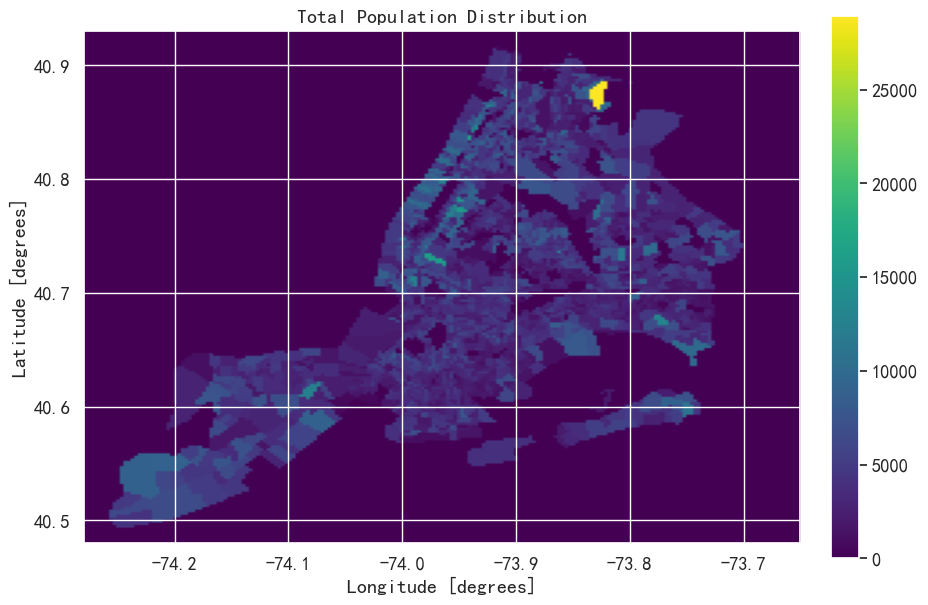
    


## 2.收入水平分布

#### 这里是家庭收入的中位数和人均收入。曼哈顿西侧125thSt以下和东侧96thSt以下通常是最富裕的地区。布朗克斯区的中部和南部似乎是最贫穷的地区。曼哈顿与其余城市的差异在人均收入地图中增加。这表明曼哈顿家庭的人口数量少于其他行政区。


```python
make_plot(blocks.Income,colors='inferno',title='Median Household Income ($)') # 家庭收入中位数分布
make_plot(blocks.IncomePerCap,colors='inferno',title='Per Capita Income ($)') # 人均收入分布
```


    
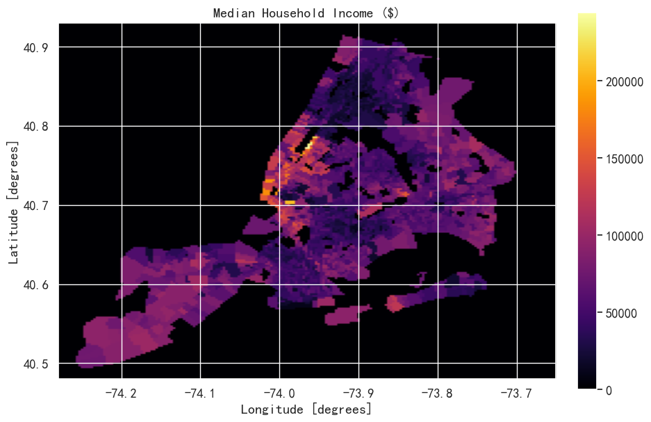
    


    
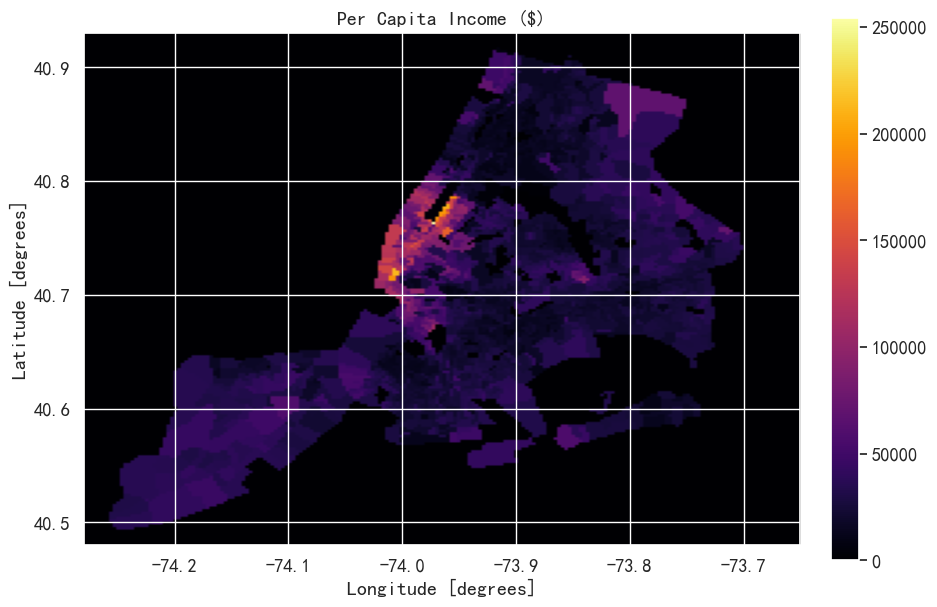
    


## 3.贫困率分布


```python
make_plot(blocks.Poverty, colors='Reds', title='Poverty Rate (%)')
```


    
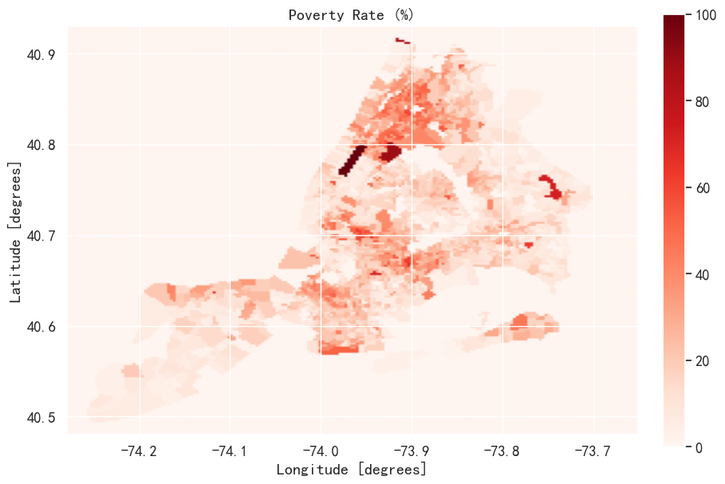
    


## 4.职业类型分布

#### 在曼哈顿、布鲁克林，从市中心到展望公园、里弗代尔和皇后区的一些地区，人们很可能从事专业工作。其他地方的人似乎大多从事工人阶级的工作。这在南布朗克斯和布鲁克林中部的大片地区尤其明显。


```python
make_plot(blocks.Professional,colors='inferno',title='% in Management, Business, Science, & Arts') # 专业职位比例图
make_plot(blocks.Service,colors='inferno',title='% in Service Jobs') # 服务类工作比例图
make_plot(blocks.Office,colors='inferno',title='% in Sales & Office Jobs') # 销售和办公室工作比例图
make_plot(blocks.Construction,colors='inferno',title='% in Nat. Resources, Construction, & Maintenance') # 建筑和维护工作比例图
make_plot(blocks.Service,colors='inferno',title='% in Production, Transportation, & Material Movement') # 生产和运输工作比例图
```


    
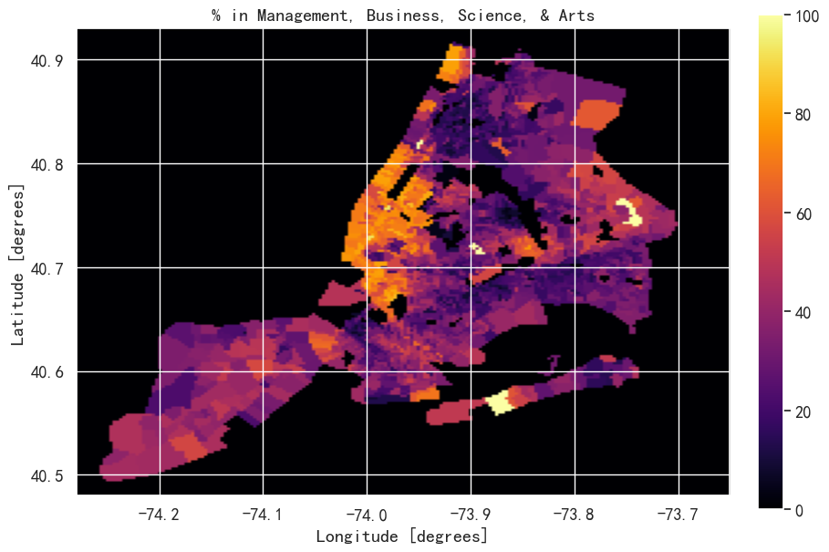
    


    

    


    
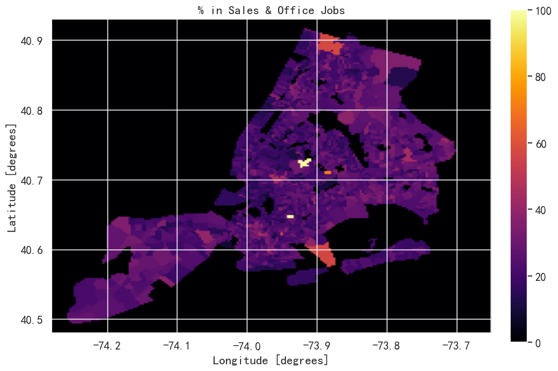
    


    
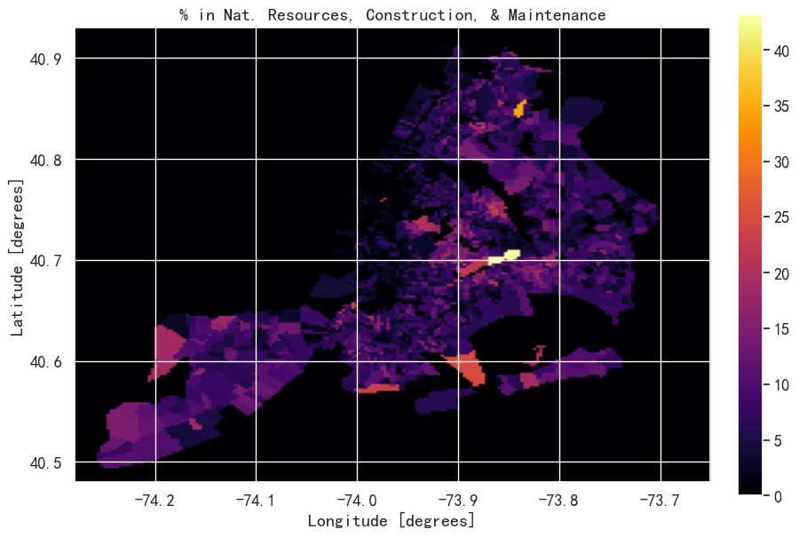
    


    
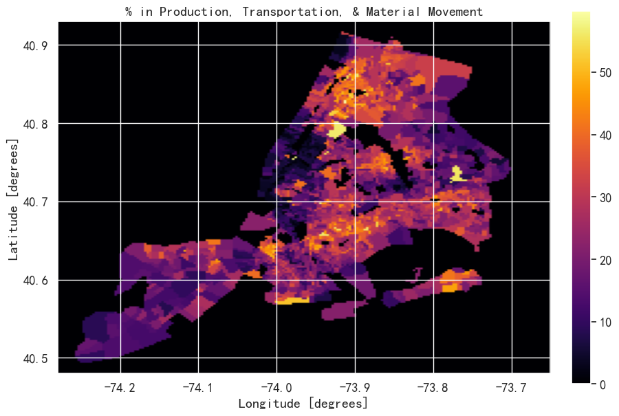
    

